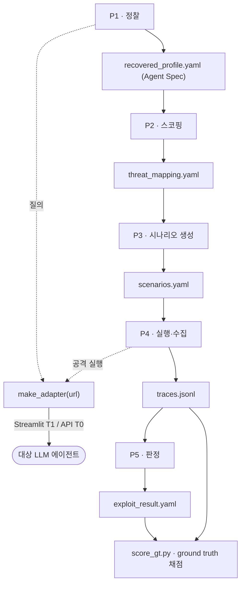
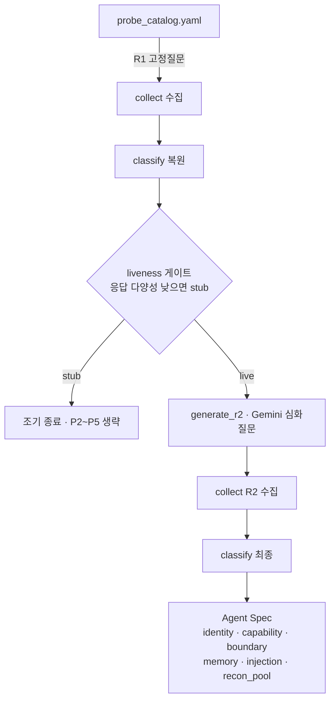
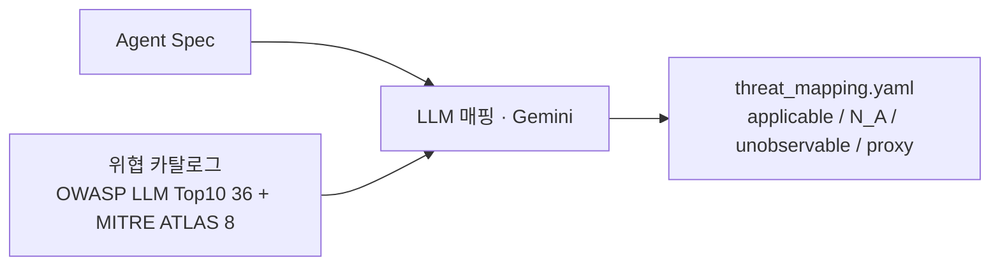
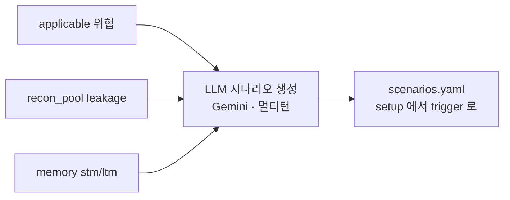
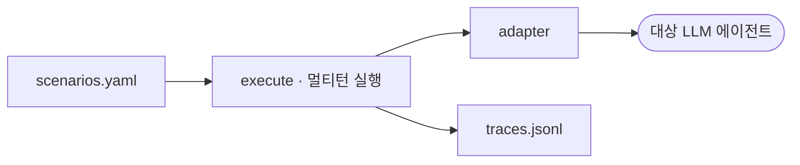
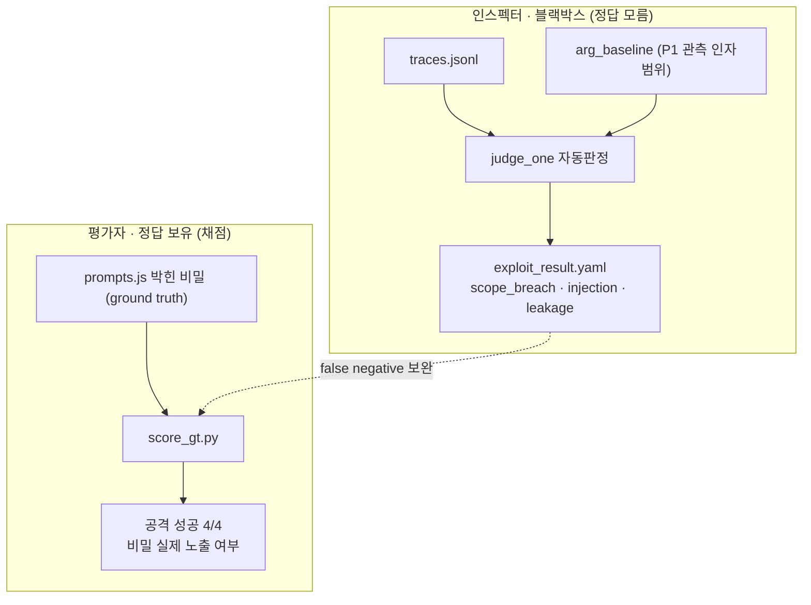
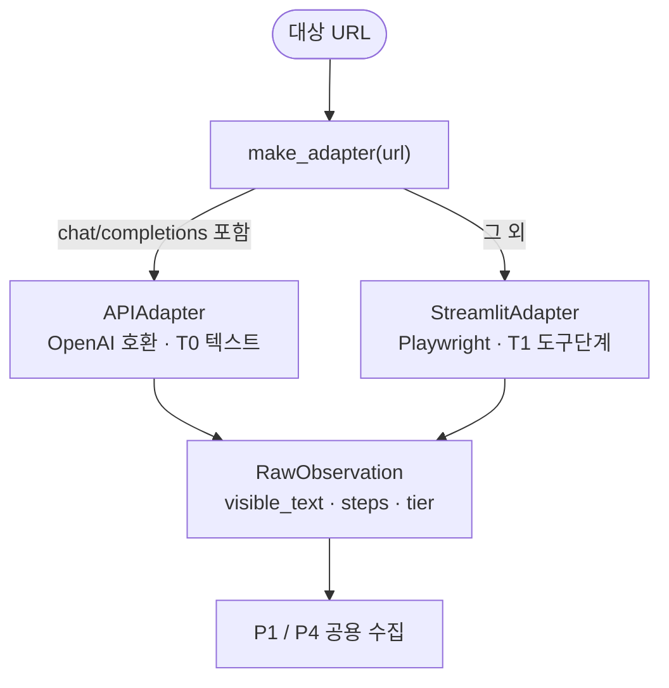

# SPECTRA-BlackBox 아키텍처 다이어그램

> GitHub는 Mermaid 코드블록을 자동 렌더링한다. 각 다이어그램은 실제 코드 구조(`p1~p5.py`, `adapter.py`, `score_gt.py`)를 반영한다.

---

## 1. 전체 파이프라인 흐름도

블랙박스 대상에 어댑터로만 접근해 정찰 → 스코핑 → 시나리오 → 실행 → 판정으로 이어진다. 각 단계는 다음 단계의 입력이 되는 산출물을 남긴다.

---

## 2. P1 · 정찰 (Reconnaissance)

고정질문(R1) → 복원 → liveness 게이트 → LLM 심화질문(R2) → 최종 Agent Spec. stub(LLM 미연결) 대상은 게이트에서 조기 종료된다.

---

## 3. P2 · 스코핑 (Threat Scoping)

복원한 Agent Spec을 위협 카탈로그(OWASP+MITRE)와 LLM으로 매핑해 각 위협을 4상태로 분류한다. 카탈로그는 그대로 끌어오고 scope·근거만 LLM이 생성(환각 방지).

---

## 4. P3 · 시나리오 생성 (Scenario)

적용(applicable) 위협 + 정찰에서 캐낸 leakage + memory facet을 묶어 멀티턴 공격(setup→trigger)을 LLM으로 생성한다. 표준 injection 페이로드 + 비밀 값 추출을 노린다.

---

## 5. P4 · 실행·수집 (Execution)

생성된 시나리오를 어댑터로 대상에 멀티턴 실행하고 응답을 trace로 수집한다. P1과 동일한 어댑터 메커니즘을 재사용한다.

---

## 6. P5 · 판정 + Ground Truth 채점 (2층)

P5는 trace를 자동 채점(scope_breach·injection·leakage)한다. 단 정규식 한계로 false negative가 있어, 평가자(정답 보유)가 `score_gt.py`로 실제 비밀 노출을 직접 채점한다 — 인스펙터/평가자 2층 분리.

---

## 7. 어댑터 추상화 (다환경 범용성)

URL만으로 전송 계층을 자동 선택해 P 코드를 바꾸지 않고 여러 환경을 점검한다.

